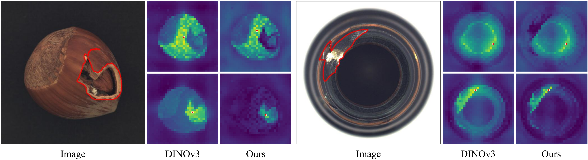
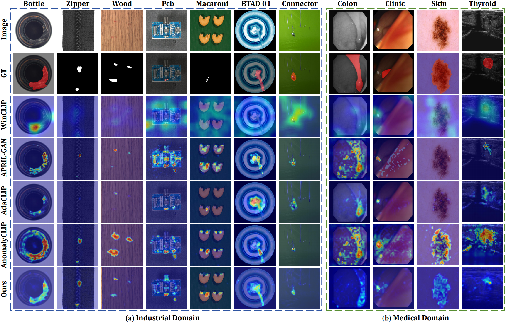

# AD-DINOv3: Enhancing DINOv3 for Zero-Shot Anomaly Detection with Anomaly-Aware Calibration

[](https://arxiv.org/abs/2509.14084)
[](https://www.python.org/)
[](https://deepwiki.com/apprisi/AD-DINOv3)



## Abstract
Zero-Shot Anomaly Detection (ZSAD) seeks to identify anomalies from arbitrary novel categories, offering a scalable and annotation-efficient solution. Traditionally, most ZSAD works have been based on the CLIP model, which performs anomaly detection by calculating the similarity between visual and text embeddings. Recently, vision foundation models such as DINOv3 have demonstrated strong transferable representation capabilities. In this work, we are the first to adapt DINOv3 for ZSAD. However, this adaptation presents two key challenges: (i) the domain bias between large-scale pretraining data and anomaly detection tasks leads to feature misalignment; and (ii) the inherent bias toward global semantics in pretrained representations often leads to subtle anomalies being misinterpreted as part of the normal foreground objects, rather than being distinguished as abnormal regions. To overcome these challenges, we introduce AD-DINOv3, a novel vision-language multimodal framework designed for ZSAD. Specifically, we formulate anomaly detection as a multimodal contrastive learning problem, where DINOv3 is employed as the visual backbone to extract patch tokens and a CLS token, and the CLIP text encoder provides embeddings for both normal and abnormal prompts. To bridge the domain gap, lightweight adapters are introduced in both modalities, enabling their representations to be recalibrated for the anomaly detection task. Beyond this baseline alignment, we further design an Anomaly-Aware Calibration Module (AACM), which explicitly guides the CLS token to attend to anomalous regions rather than generic foreground semantics, thereby enhancing discriminability. Finally, anomaly localization are achieved by measuring the similarity between adapted visual features and prompt embeddings. Extensive experiments on eight industrial and medical benchmarks demonstrate that AD-DINOv3 consistently matches or surpasses state-of-the-art methods, verifying its effectiveness and broad applicability as a general zero-shot anomaly detection framework.

## Results


## Quick Start 
### 1. Installation  
```bash
git clone https://github.com/Kaisor-Yuan/AD-DINOv3.git
cd AD-DINOv3
conda create -n AD-DINOv3 python=3.10  
conda activate AD-DINOv3  
pip install -r requirements.txt  
```
### 2. Datasets
The datasets evaluated in our paper include MVTec AD, VisA, MPDD, BTAD, ISIC, CVC-ColonDB, CVC-ClinicDB, TN3K. Please organize the datasets as follows:
```
./Data/Industrial_Datasets/
├── MVTecAD/
│ ├── bottle/
│ │ ├── test/
│ │ │ ├── broken_large/
│ │ │ ├── ...
│ │ │ └── good/
│ │ └── ground_truth/
│ │   ├── broken_large/
│ │   ├── ...
│ │   └── contamination/
│ ├── ...
│ └── zipper/
│
├── VisA_20220922/
│ ├── candle/
│ ├── ...
│ └── pipe_fryum/
│
├── MPDD/
│ ├── bracket_black/
│ ├── ...
│ └── tubes/
│
└── BTech_Dataset_transformed/
  ├── 01/
  ├── ...
  └── 03/

./Data/Medical_Datasets/
├── ISIC/
│ └── 01/
├── CVC-ColonDB/
│ └── 01/
├── CVC-ClinicDB/
│ └── 01/
└── TN3K/
  └── 01/
```

Put all the industrial datasets under ``./Data/Industrial_Datasets`` and Medical datasets under ``./Data/Medical_Datasets``. Please see the specific details in ``./Datasets/__init__.py``

### 3. Training & Evaluation
```bash
# training
python train.py --result_path $save_path --device $device --dataset $dataset
# evaluation
python test.py --result_path $save_path --dataset $dataset
# (Optional) we provide bash script for evaluating all the datasets
bash test.sh
```
To run the code, please download the pretrained weights and place them in the specified directories:

| ✅ **Pretrained Model** | 🌐 **Source Link** | 📁 **Destination Path** |
|:-----------------------:|:------------------|:------------------------|
| **OpenCLIP ViT-L-14-336px** | [🔗 OpenCLIP Checkpoints](https://github.com/mlfoundations/open_clip) | `./CLIP/ckpt/` |
| **Meta AI DINOv3 (vitl16_pretrain_lvd)** | [🔗 DINOv3 Official Weights](https://github.com/facebookresearch/dinov3) | `./` *(project root)* |


## Citation
If you use this work, please cite:
```
@article{yuan2025ad,
  title={AD-DINOv3: Enhancing DINOv3 for Zero-Shot Anomaly Detection with Anomaly-Aware Calibration},
  author={Yuan, Jingyi and Ye, Jianxiong and Chen, Wenkang and Gao, Chenqiang},
  journal={arXiv preprint arXiv:2509.14084},
  year={2025}
}
```

⭐ Star this repo if you find it useful!
